# 🅿️ Parking Lot Management System

A sophisticated **Spring Boot-based parking lot management system** designed with enterprise-grade architecture patterns. This application efficiently manages vehicle parking operations, including ticket generation, slot assignment, and parking lot administration.

## 📋 Table of Contents

- [Overview](#overview)
- [Features](#features)
- [Architecture & Class Diagram](#architecture--class-diagram)
- [Technology Stack](#technology-stack)
- [Project Structure](#project-structure)
- [Setup & Installation](#setup--installation)
- [Running the Application](#running-the-application)
- [API Usage](#api-usage)
- [Design Patterns Used](#design-patterns-used)

---

## 🎯 Overview

The **Parking Lot Management System** is a comprehensive solution for managing multi-floor parking facilities with intelligent slot assignment algorithms. It handles vehicle registration, ticket generation, and parking space allocation with support for multiple vehicle types.

### Key Capabilities

- **Multi-floor parking management** with customizable slot configurations
- **Intelligent slot assignment** using strategy pattern (Random, Nearest, Farthest)
- **Vehicle type support** (Two-wheeler, Three-wheeler, Four-wheeler, Heavy vehicles)
- **Dynamic fee calculation** based on parking duration and vehicle type
- **Gate management** for entry/exit operations
- **Operator management** for parking lot staff

---

## ✨ Features

✅ **Ticket Generation** - Automated ticket creation with unique ID assignment  
✅ **Smart Slot Assignment** - Multiple assignment strategies for optimal space utilization  
✅ **Vehicle Management** - Automatic vehicle registration on first entry  
✅ **Multi-floor Support** - Organize parking across multiple floors  
✅ **Fee Calculation** - Flexible fee strategies (Weekday, Weekend, Festival)  
✅ **Gate Operations** - Track entry/exit through designated gates  
✅ **Error Handling** - Comprehensive validation and error messages  
✅ **Extensible Design** - Easy to add new features and strategies  

---

## 🏗️ Architecture & Class Diagram

### Mermaid Class Diagram

```mermaid
classDiagram
    %% Main Application
    class ParkingLotApplication {
        +main(String[] args) void
    }

    %% Controller Layer
    class TicketController {
        -ticketService: TicketService
        +TicketController(TicketService)
        +issueTicket(IssueTicketRequest): IssueTicketResponse
    }

    %% Service Layer
    class TicketService {
        -gateRepository: GateRepository
        -vehicleRepository: VehicleRepository
        -parkingLotRepository: ParkingLotRepository
        -ticketRepository: TicketRepository
        +TicketService(GateRepository, VehicleRepository, ParkingLotRepository, TicketRepository)
        +issueTicket(Long, String, String, VehicleType, Long): Ticket
    }

    %% DTO Layer
    class IssueTicketRequest {
        -licensePlate: String
        -gateId: Long
        -ownerName: String
        -vehicleType: VehicleType
        -parkingLotId: Long
        +builder(): IssueTicketRequestBuilder
    }

    class IssueTicketResponse {
        -ticketId: Long
        -responseStatus: ResponseStatus
        -failureMessage: String
        -slotNumber: Integer
        +builder(): IssueTicketResponseBuilder
    }

    %% Repository Layer
    class GateRepository {
        -gates: Map~Long, Gate~
        +GateRepository()
        +findGateByGateId(Long): Optional~Gate~
    }

    class ParkingLotRepository {
        -parkingLots: Map~Long, ParkingLot~
        +ParkingLotRepository()
        +findParkingLotById(Long): Optional~ParkingLot~
    }

    class VehicleRepository {
        -vehicles: Map~String, Vehicle~
        -counter: Long
        +VehicleRepository()
        +findVehicleByLicenseNumber(String): Optional~Vehicle~
        +save(Vehicle): Vehicle
    }

    class TicketRepository {
        -tickets: Map~Long, Ticket~
        -counter: Long
        +save(Ticket): Ticket
    }

    %% Base Model
    class BaseModel {
        #id: Long
        +getId(): Long
        +setId(Long): void
    }

    %% Domain Models
    class ParkingLot {
        -operator: Operator
        -exitGates: List~Gate~
        -entryGates: List~Gate~
        -floors: List~Floor~
        -allowedVehicleTypes: HashMap~VehicleType, Integer~
        -slotStatus: SlotStatus
        -feeCalculationStrategy: FeeCalculationStrategy
        -slotAssigningStrategy: SlotAssigningStrategy
    }

    class Floor {
        -floorNumber: String
        -slots: List~Slot~
        -allowedVehicles: List~VehicleType~
        -floorStatus: FloorStatus
    }

    class Slot {
        -slotNumber: Integer
        -allowedVehicleTypes: Set~VehicleType~
        -slotStatus: SlotStatus
        -floor: Floor
    }

    class Gate {
        -gateNumber: String
        -gateType: GateType
        -gateStatus: GateStatus
        -currentOperator: Operator
    }

    class Vehicle {
        -vehicleType: VehicleType
        -licensePlate: String
        -ownerName: String
    }

    class Ticket {
        -entryTime: Date
        -vehicle: Vehicle
        -entryGate: Gate
        -operator: Operator
        -slot: Slot
        -feeCalculationStrategy: FeeCalculationStrategy
        -floor: Floor
    }

    class Operator {
        -name: String
        -operatorId: String
    }

    %% Strategy Pattern
    class SlotAssigningStrategy {
        <<interface>>
        +assignSlot(ParkingLot, VehicleType): Slot*
    }

    class RandomAssigning {
        +assignSlot(ParkingLot, VehicleType): Slot
    }

    class NearestAssigning {
        +assignSlot(ParkingLot, VehicleType): Slot
    }

    class FarthestAssigning {
        +assignSlot(ParkingLot, VehicleType): Slot
    }

    %% Enums
    class VehicleType {
        <<enumeration>>
        TWO_WHEELER
        THREE_WHEELER
        LIGHT_FOUR_WHEELER
        FOUR_WHEELER
        HEAVY
    }

    class SlotStatus {
        <<enumeration>>
        EMPTY
        FILLED
    }

    class GateStatus {
        <<enumeration>>
        OPEN
        CLOSED
    }

    class GateType {
        <<enumeration>>
        ENTRY
        EXIT
    }

    class ResponseStatus {
        <<enumeration>>
        SUCCESS
        FAILURE
    }

    class FeeCalculationStrategy {
        <<enumeration>>
        WEEKDAY
        WEEKEND
        FESTIVAL
    }

    class FloorStatus {
        <<enumeration>>
        ACTIVE
        INACTIVE
    }

    %% Relationships
    ParkingLotApplication --> TicketController
    TicketController --> TicketService
    TicketController --> IssueTicketRequest
    TicketController --> IssueTicketResponse

    TicketService --> GateRepository
    TicketService --> VehicleRepository
    TicketService --> ParkingLotRepository
    TicketService --> TicketRepository

    GateRepository --> Gate
    ParkingLotRepository --> ParkingLot
    VehicleRepository --> Vehicle
    TicketRepository --> Ticket

    BaseModel <|-- ParkingLot
    BaseModel <|-- Floor
    BaseModel <|-- Slot
    BaseModel <|-- Gate
    BaseModel <|-- Vehicle
    BaseModel <|-- Ticket
    BaseModel <|-- Operator

    ParkingLot --> Floor
    ParkingLot --> Gate
    ParkingLot --> SlotAssigningStrategy
    ParkingLot --> FeeCalculationStrategy

    Floor --> Slot
    Slot --> Floor
    Slot --> SlotStatus
    Slot --> VehicleType

    Gate --> Operator
    Gate --> GateType
    Gate --> GateStatus

    Vehicle --> VehicleType

    Ticket --> Vehicle
    Ticket --> Gate
    Ticket --> Operator
    Ticket --> Slot
    Ticket --> Floor
    Ticket --> FeeCalculationStrategy

    SlotAssigningStrategy <|.. RandomAssigning
    SlotAssigningStrategy <|.. NearestAssigning
    SlotAssigningStrategy <|.. FarthestAssigning

    IssueTicketRequest --> VehicleType
    IssueTicketResponse --> ResponseStatus
```



### Data Flow Diagram

```
┌─────────────────────────────────────────────────────────────────────┐
│                    TICKET GENERATION FLOW                           │
└─────────────────────────────────────────────────────────────────────┘

User Request (IssueTicketRequest)
    │ licensePlate, gateId, ownerName, vehicleType, parkingLotId
    │
    ▼
┌─────────────────────────────────────────────────────────────────────┐
│ TicketController.issueTicket()                                      │
│ • Receives HTTP request                                             │
│ • Delegates to TicketService                                        │
│ • Catches exceptions & returns IssueTicketResponse                  │
└─────────────────────────────────────────────────────────────────────┘
    │
    ▼
┌─────────────────────────────────────────────────────────────────────┐
│ TicketService.issueTicket()                                         │
│                                                                     │
│ Step 1: Validate Gate                                               │
│   └─► GateRepository.findGateByGateId(gateId)                       │
│       ✓ If found → Continue                                         │
│       ✗ If not found → Throw "Gate id is invalid"                   │
│                                                                     │
│ Step 2: Get or Create Vehicle                                       │
│   └─► VehicleRepository.findVehicleByLicenseNumber(licensePlate)    │
│       ✓ If exists → Use existing                                    │
│       ✗ If not → Create new & save                                  │
│                                                                     │
│ Step 3: Validate ParkingLot                                         │
│   └─► ParkingLotRepository.findParkingLotById(parkingLotId)         │
│       ✓ If found → Continue                                         │
│       ✗ If not found → Throw "Invalid Parking Lot Id"               │
│                                                                     │
│ Step 4: Assign Slot                                                 │
│   └─► SlotAssigningStrategy.assignSlot(parkingLot, vehicleType)     │
│       • Iterates through floors                                     │
│       • Finds first EMPTY slot matching vehicle type                │
│       • Sets slot status to FILLED                                  │
│                                                                     │
│ Step 5: Create Ticket                                               │
│   └─► Build Ticket object with:                                    │
│       • entryTime (current timestamp)                               │
│       • entryGate (from step 1)                                     │
│       • vehicle (from step 2)                                       │
│       • slot (from step 4)                                          │
│       • operator (from gate)                                        │
│       • floor (from slot)                                           │
│       • feeCalculationStrategy (from parking lot)                   │
│                                                                     │
│ Step 6: Save Ticket                                                 │
│   └─► TicketRepository.save(ticket)                                 │
│       • Auto-increment ticket ID                                    │
│       • Store in repository                                         │
│       • Return saved ticket                                         │
└─────────────────────────────────────────────────────────────────────┘
    │
    ▼
┌─────────────────────────────────────────────────────────────────────┐
│ Response (IssueTicketResponse)                                      │
│ ✓ SUCCESS: { ticketId, slotNumber, status: SUCCESS }               │
│ ✗ FAILURE: { failureMessage, status: FAILURE }                     │
└─────────────────────────────────────────────────────────────────────┘
```

---

## 🛠️ Technology Stack

| Component | Technology | Version |
|-----------|-----------|---------|
| **Framework** | Spring Boot | 4.0.3 |
| **Language** | Java | 21 |
| **Build Tool** | Maven | 3.x |
| **Dependency Injection** | Spring DI | Built-in |
| **Lombok** | Code Generation | 1.18.42 |
| **Testing** | JUnit 5 | Spring Boot Test |

---

## 📁 Project Structure

```
parking-lot/
├── src/
│   ├── main/
│   │   ├── java/com/utsavi/parkingLot/
│   │   │   ├── ParkingLotApplication.java          # Main entry point
│   │   │   ├── controller/
│   │   │   │   └── TicketController.java           # REST endpoints
│   │   │   ├── service/
│   │   │   │   └── TicketService.java              # Business logic
│   │   │   ├── repository/
│   │   │   │   ├── GateRepository.java
│   │   │   │   ├── ParkingLotRepository.java
│   │   │   │   ├── VehicleRepository.java
│   │   │   │   └── TicketRepository.java
│   │   │   ├── model/
│   │   │   │   ├── BaseModel.java                  # Abstract base
│   │   │   │   ├── ParkingLot.java
│   │   │   │   ├── Floor.java
│   │   │   │   ├── Slot.java
│   │   │   │   ├── Gate.java
│   │   │   │   ├── Vehicle.java
│   │   │   │   ├── Ticket.java
│   │   │   │   ├── Operator.java
│   │   │   │   └── ...
│   │   │   ├── dto/
│   │   │   │   ├── IssueTicketRequest.java
│   │   │   │   └── IssueTicketResponse.java
│   │   │   ├── enums/
│   │   │   │   ├── VehicleType.java
│   │   │   │   ├── SlotStatus.java
│   │   │   │   ├── GateType.java
│   │   │   │   ├── ResponseStatus.java
│   │   │   │   └── ...
│   │   │   └── stratergy/
│   │   │       └── slot/
│   │   │           ├── SlotAssigningStrategy.java  # Strategy interface
│   │   │           ├── RandomAssigning.java
│   │   │           ├── NearestAssigning.java
│   │   │           └── FarthestAssigning.java
│   │   └── resources/
│   │       └── application.yaml
│   └── test/
│       └── java/...
├── pom.xml                                          # Maven configuration
└── README.md                                        # This file
```

---

## 🚀 Setup & Installation

### Prerequisites

Ensure you have the following installed on your system:

- **Java 21** or higher
  ```bash
  java -version
  ```
- **Maven 3.6+**
  ```bash
  mvn -version
  ```
- **Git** (optional, for cloning)

### Step 1: Clone the Repository

```bash
git clone https://github.com/utsavipatil/Parking-Lot.git
cd Parking-Lot
```

### Step 2: Install Dependencies

```bash
mvn clean install
```

This command will:
- Clean any previous builds
- Download all dependencies from `pom.xml`
- Compile the source code
- Run tests (if any)

### Step 3: Build the Project

```bash
mvn clean package
```

This creates an executable JAR file in the `target/` directory.

---

## ▶️ Running the Application

### Option 1: Run from IDE (IntelliJ IDEA / Eclipse)

1. Open the project in your IDE
2. Navigate to `ParkingLotApplication.java`
3. Right-click → **Run 'ParkingLotApplication.main()'**

### Option 2: Run via Maven

```bash
mvn spring-boot:run
```

### Option 3: Run the JAR File

```bash
java -jar target/parkingLot-0.0.1-SNAPSHOT.jar
```

### Expected Output

```
Ticket Generated Successful ! Ticket Id: 1
Pl Park at 1
```

---

## 📡 API Usage

### Issue Ticket Endpoint

**Request:**
```java
IssueTicketRequest request = IssueTicketRequest.builder()
    .licensePlate("GJ0124324")
    .gateId(1L)
    .ownerName("Dolly")
    .vehicleType(VehicleType.TWO_WHEELER)
    .parkingLotId(1L)
    .build();

IssueTicketResponse response = ticketController.issueTicket(request);
```

**Success Response:**
```json
{
  "ticketId": 1,
  "responseStatus": "SUCCESS",
  "slotNumber": 1,
  "failureMessage": null
}
```

**Failure Response:**
```json
{
  "ticketId": null,
  "responseStatus": "FAILURE",
  "slotNumber": null,
  "failureMessage": "Gate id is invalid"
}
```

---

## 🎨 Design Patterns Used

### 1. **Strategy Pattern**
- **Location:** `stratergy/slot/`
- **Purpose:** Multiple slot assignment algorithms (Random, Nearest, Farthest)
- **Benefit:** Easy to add new strategies without modifying existing code

### 2. **Repository Pattern**
- **Location:** `repository/`
- **Purpose:** Abstract data access layer
- **Benefit:** Decouples business logic from data persistence

### 3. **Service Layer Pattern**
- **Location:** `service/`
- **Purpose:** Encapsulates business logic
- **Benefit:** Centralized validation and orchestration

### 4. **DTO (Data Transfer Object) Pattern**
- **Location:** `dto/`
- **Purpose:** Separate API contracts from domain models
- **Benefit:** Flexible API design independent of database schema

### 5. **Builder Pattern**
- **Usage:** Lombok `@Builder` on models and DTOs
- **Benefit:** Fluent, readable object construction

### 6. **Enum Pattern**
- **Location:** `enums/`
- **Purpose:** Type-safe constants for statuses and types
- **Benefit:** Prevents invalid values and improves code clarity

---

## 🔧 Configuration

Edit `src/main/resources/application.yaml` to customize:

```yaml
spring:
  application:
    name: parkingLot
  jpa:
    hibernate:
      ddl-auto: update
```

---

## 📝 Example Scenario

### Scenario: A vehicle enters the parking lot

1. **Vehicle Details:**
   - License Plate: `GJ0124324`
   - Owner: `Dolly`
   - Type: `TWO_WHEELER`

2. **Parking Lot Details:**
   - Parking Lot ID: `1`
   - Gate ID: `1`

3. **Process:**
   - Gate is validated ✓
   - Vehicle is registered (if new) ✓
   - Parking lot is found ✓
   - Nearest empty slot is assigned ✓
   - Ticket is generated with ID `1` ✓

4. **Output:**
   ```
   Ticket Generated Successful ! Ticket Id: 1
   Pl Park at 1
   ```

---

## 🐛 Troubleshooting

| Issue | Solution |
|-------|----------|
| **Java version mismatch** | Ensure Java 21+ is installed: `java -version` |
| **Maven not found** | Install Maven or add to PATH |
| **Port already in use** | Change port in `application.yaml` |
| **Gate id is invalid** | Ensure gate ID `1` exists in `GateRepository` |
| **Invalid Parking Lot Id** | Ensure parking lot ID `1` exists in `ParkingLotRepository` |
| **Build fails** | Run `mvn clean install` to reset |

---

## 📚 Learning Resources

- [Spring Boot Documentation](https://spring.io/projects/spring-boot)
- [Design Patterns in Java](https://refactoring.guru/design-patterns/java)
- [Maven Documentation](https://maven.apache.org/guides/)
- [Lombok Documentation](https://projectlombok.org/)

---

## 📄 License

This project is licensed under the MIT License - see the LICENSE file for details.

---

## 👨‍💻 Author

**Utsavi Patil**  
GitHub: [@utsavipatil](https://github.com/utsavipatil)

---

## 🤝 Contributing

Contributions are welcome! Please follow these steps:

1. Fork the repository
2. Create a feature branch (`git checkout -b feature/AmazingFeature`)
3. Commit your changes (`git commit -m 'Add AmazingFeature'`)
4. Push to the branch (`git push origin feature/AmazingFeature`)
5. Open a Pull Request

---

## ⭐ Show Your Support

If you found this project helpful, please give it a star! ⭐

---

**Last Updated:** March 2026  
**Version:** 1.0.0
